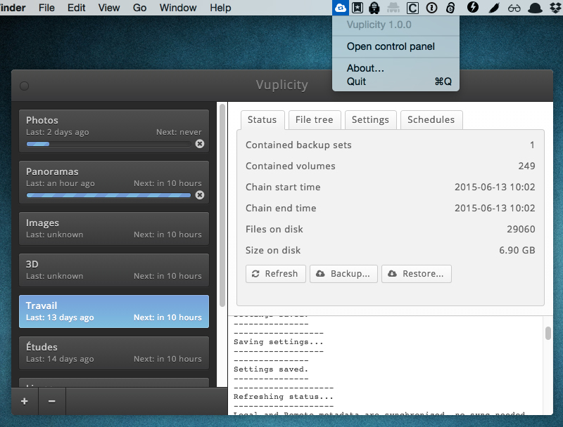

# Vuplicity


A cross-platform GUI for Duplicity backups, powered by Atom Electron.

* [Features](#features)
* [Download](#download)
* [Installation and development](#installation-and-development)
* [Todos and caveats](#todos-and-caveats)
* [Changelog](#changelog)
* [License](#license)
* [Credits](#credits)

## Features



The GUI works directly with Duplicity by sending shell commands, so you can use your existing backups and / or create new ones independently.

#### Backup status

Check the status of a backup, start it manually, or restore its content.

#### Configuration

Fill the source path, destination URL, passphrase, and custom CLI options if needed.

You can add several backup configurations on the left panel.

The configuration uses one JSON file per backup, stored in `$HOME/.vuplicity`.

#### File tree

Check the content of the backup, or choose to restore a single file.

#### Scheduler

Schedule the backup by choosing a delay or a time, and the days when you want it to be applied (in the week or month).

You may also combine multiple schedules (for instance, one incremental backup each day at 2:00am, and one full backup once a month).

## Download

*[Duplicity](http://duplicity.nongnu.org/) is not shipped with the app.*

*You have to install it first, and ensure that the `duplicity` command is included in your global `$PATH` to allow the app to access it.*

### OSX

You can download the last version of the app on the [Releases](https://github.com/johansatge/vuplicity/releases) page.

### Linux & Windows

**Help needed !**

For now no binaries are available, because I didn't run advanced tests on those platforms.

If you want to get involved, feel free to follow the installation steps above, and test the project by yourself.

Comments are very welcome on the [Issues](https://github.com/johansatge/vuplicity/issues) page.

## Installation and development

### Installation steps

**1.** Install [node.js](https://nodejs.org/) and [npm](https://github.com/npm/npm) if needed

**2.** Install [Atom Electron](http://electron.atom.io/) if needed (by using `npm`)

**3.** Install [Grunt](http://gruntjs.com/) if needed

**4.** Get the project and its dependencies

```bash
git clone https://github.com/johansatge/vuplicity.git
npm install
cd vuplicity/app && npm install
```

### Development

Run the application:

```bash
grunt run
```

The following options are available, if needed:

| Option | Usage |
| :--- | :--- |
| `grunt run --devtools` | Opens the devtools with the control panel |
| `grunt run --configpath=/Users/johan/.vuplicity-dev` | Overrides the path of the config |

Build the application for the desired platform:

```bash
grunt build --platforms=darwin,linux,win32
```

Watch for SASS updates:

```bash
grunt sass
```

## Todos and caveats

### App wrapper

Add a build task to wrap the app for each platform.

### Backup confirmation

* Add confirmation email - or notifications - with backup status
* Displays duplicity informations in the status tab (delta files, etc)

### Update checker

Regularly check for updates and display a notice (on the control panel or the tray icon ?).

Allow the user to disable auto-check in the tray menu.

### Fix unsecure passphrases

Passphrases are stored in clear text in the configuration files.

It may be nice to encrypt the files with a global passphrase, and ask it to the user when starting the GUI.

### Backup informations

Add new backup informations, such as:

* ~~Next planned backup date on the left panel~~
* ~~Current backup size in the **Status** tab~~
* Informations on next planned backup (count of added & deleted files ?)

~~Make dates more readable (by using *from* and *to* notations ?)~~

### Interactive CLI

For now, there is no way to interact with the CLI tool.

For instance, when using the Dropbox backend, you have to load an authorization URL, and then tell the script to continue.

This step has to be executed manually; when it's done, you will be able to use the GUI.

## Changelog

| Version | Date | Notes |
| --- | --- | --- |
| `1.0.0` | June 26th, 2015 | Initial version |

## License

This project is released under the [MIT License](LICENSE).

## Credits

* [Atom Electron](http://electron.atom.io)
* [Font Awesome](http://fontawesome.io)
* [Glob](https://github.com/isaacs/node-glob)
* [Later](https://github.com/bunkat/later)
* [yargs](https://github.com/bcoe/yargs)
* [electron-packager](https://github.com/maxogden/electron-packager)
* [moment](http://momentjs.com/)
* [request](https://github.com/request/request)
* [compare-versions](https://github.com/omichelsen/compare-versions)
